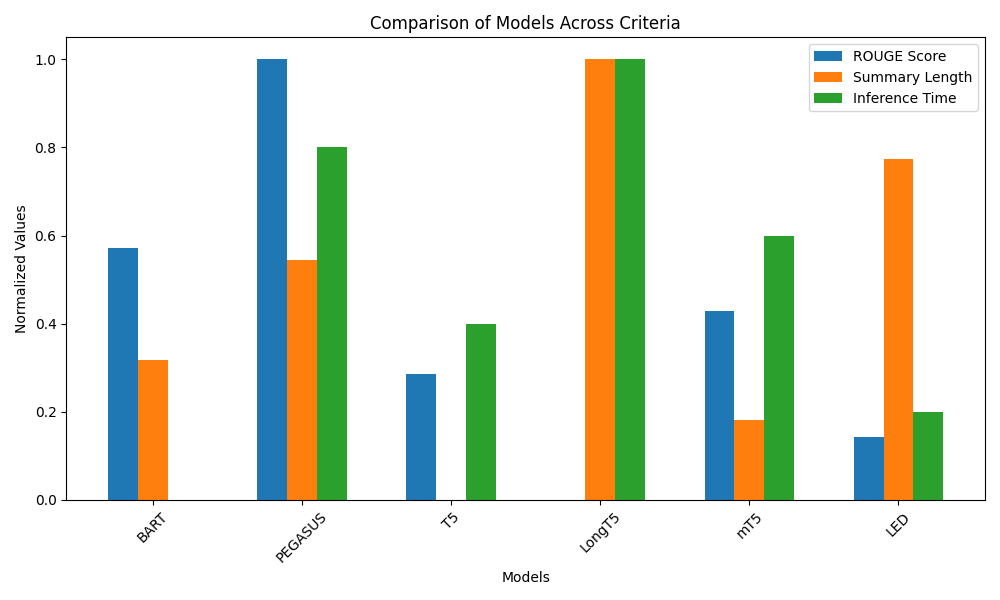
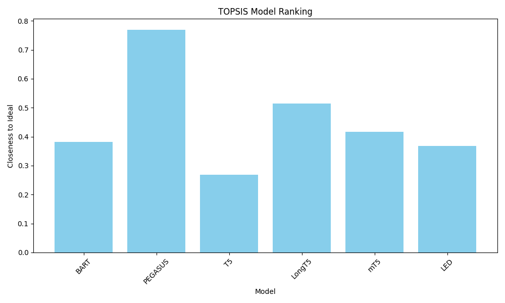
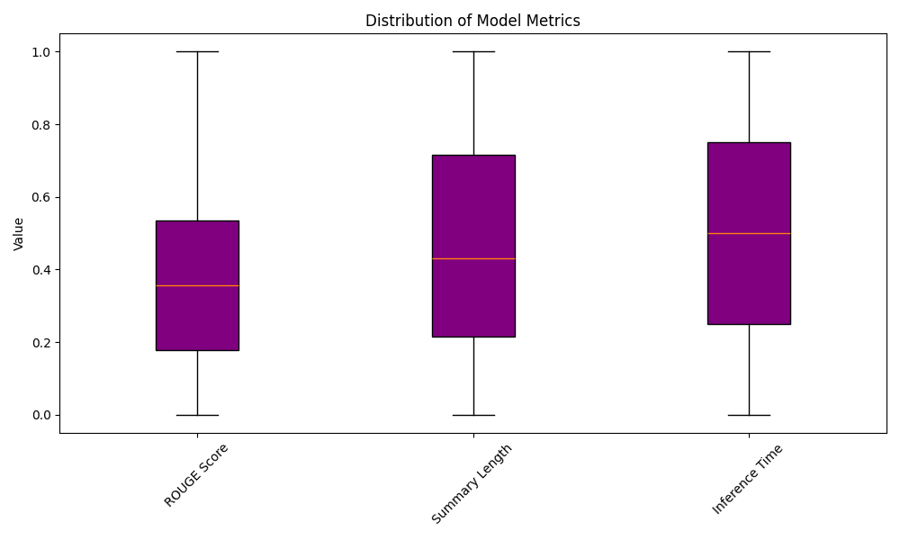

# **TOPSIS Analysis of Pre-Trained Text Summarization Models 📝📊**

This repository analyzes various **text summarization** models using the **TOPSIS** method. Models evaluated include BART, PEGASUS, T5, LongT5, mT5, and LED. The analysis compares them based on ROUGE Score, Summary Length, and Inference Time.

## **Project Overview 🚀**
This project ranks text summarization models based on ROUGE Score, Summary Length, and Inference Time using the TOPSIS method.

## **Data Description 📊**
Data includes the following columns:

Model: Name of the model 
ROUGE Score: Measures summary quality 
Summary Length: Length of the generated summary 
Inference Time (sec): Time taken for generation 

## **TOPSIS Methodology**
TOPSIS is used to rank models by computing their relative closeness to the ideal solution. The process includes the following steps:
1. Normalization
2. Weight Assignment
3. Ideal Solutions
4. Separation Measures
5. Closeness to Ideal

## **Results**
The models are ranked based on their closeness to the ideal solution, which is computed using the TOPSIS method. The model with the highest closeness value is considered the best.

Top 3 Models: PEGASUS, LongT5, mT5 

## **Visualizations 📊**
**1. Comparison Bar Plot 📊:**

**2. Model Ranking by Closeness 🏆**

**3. Box Plot 📦**

